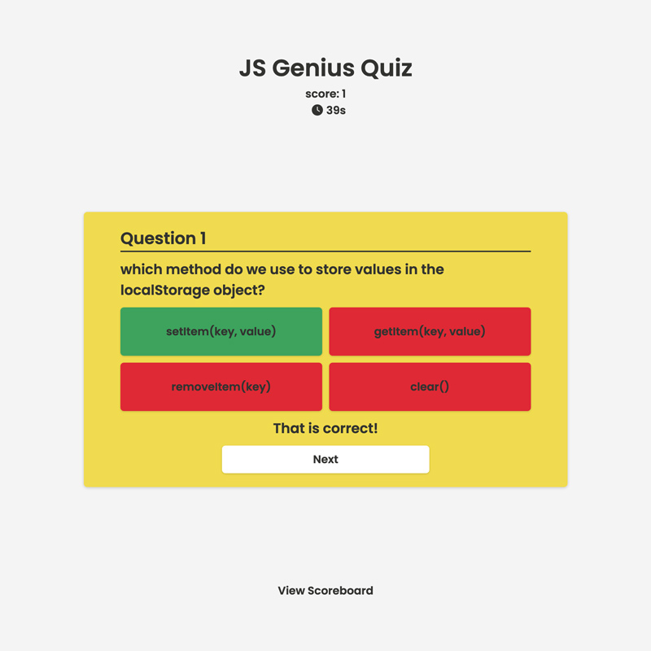
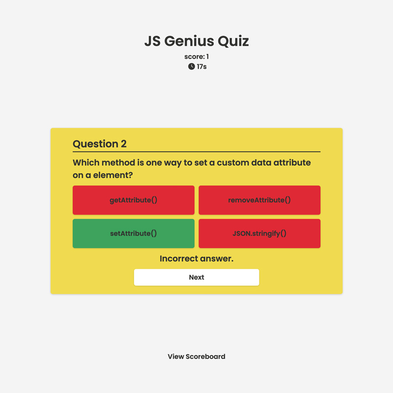
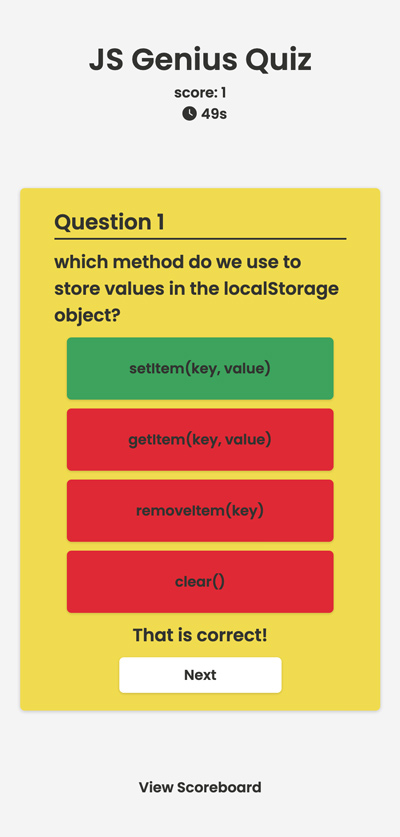
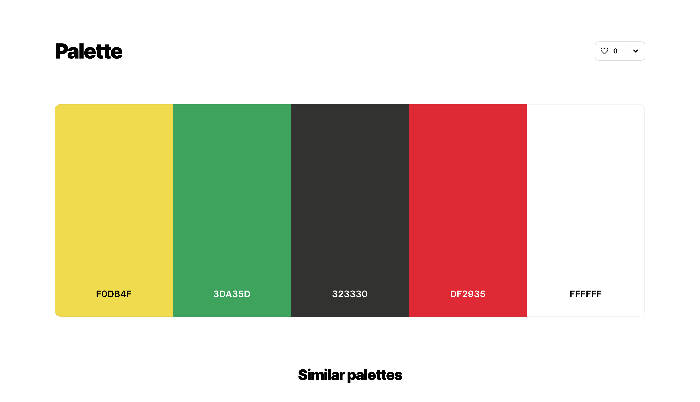
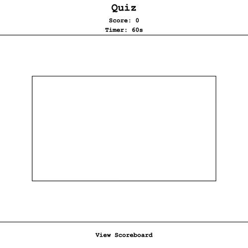

# js-genius-quiz

A dynamic quiz application that tests you on your javascript knowledge.

## Tables Of Content

1. [The Assignment Brief](#the-assignment-brief)

2. [Github Pages & Repository Links](github-pages-&-repository-links)

3. [JS Genius App Screenshots](js-genius-app-screenshots)

4. [My Process](my-process)

5. [Acknowledgements](acknowledgements)

## The Assignment Brief

Create a timed coding quiz app with multiple-choice questions that will run in the browser. It should feature dynamically updated HTML and CSS powered by JavaScript code. The appearance of the application should be clean and polished. The app should be responsive to all viewport sizes.

## Github Pages & Repository Links

[Github Pages](https://matthew-millard.github.io/js-genius-quiz/)

[Github Repository](https://github.com/matthew-millard/js-genius-quiz)

## JS Genius App Screenshots

## My Process

1. Generate a colour palette on [coolors.co](https://coolors.co/)

2. Create a basic wireframe of the layout.

3. Build out the inital HTML and CSS with a mobile first approach.

4. Create and array of objects containing all the questions and answers.

5. Dynamically updated the HTML and CSS with JavaScript.

6. Tested for bugs and rectified code accordingly.

7. Refactored code and deployed on github pages.

## Acknowledgements

[Michael Karén - How to save High Scores In local Storage](https://michael-karen.medium.com/how-to-save-high-scores-in-local-storage-7860baca9d68)

[Web Dev Simplified - Quiz App with JavaScript](https://www.youtube.com/watch?v=riDzcEQbX6k)
